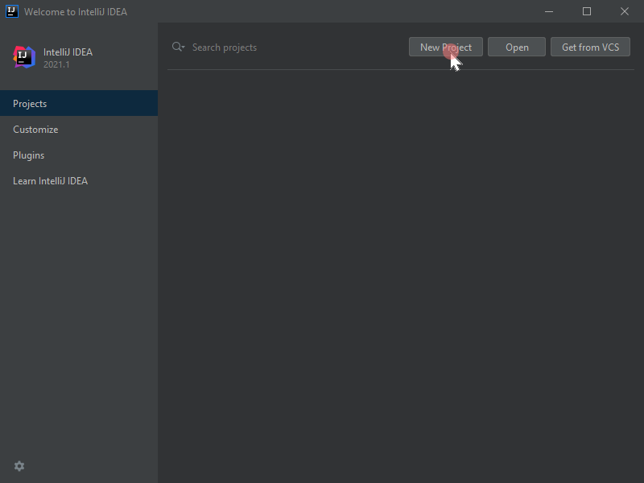
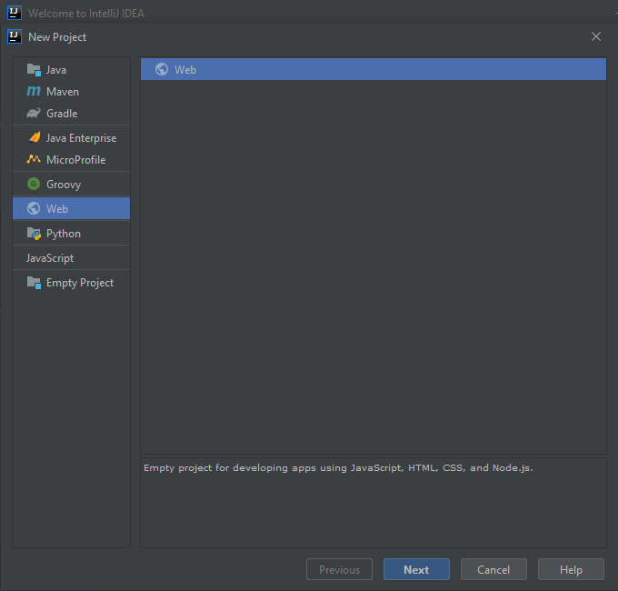
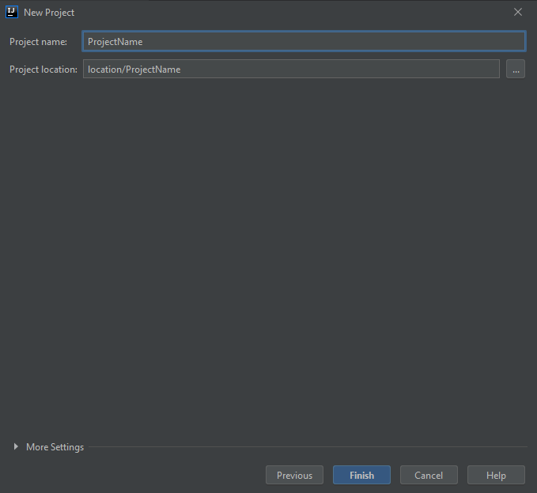
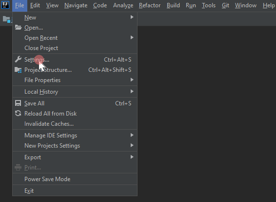
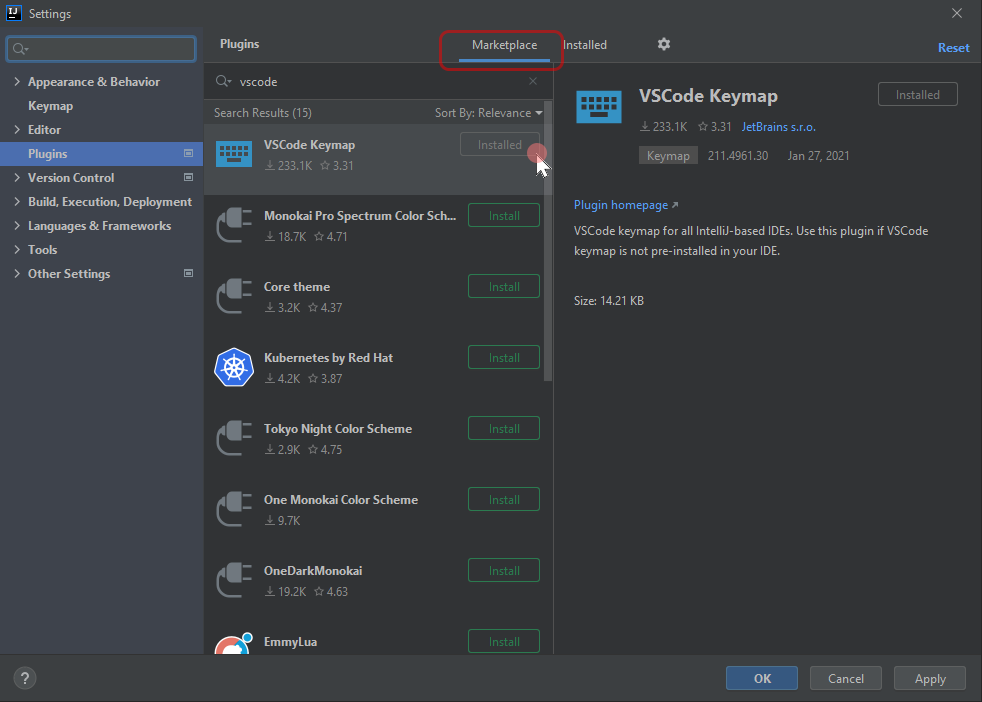
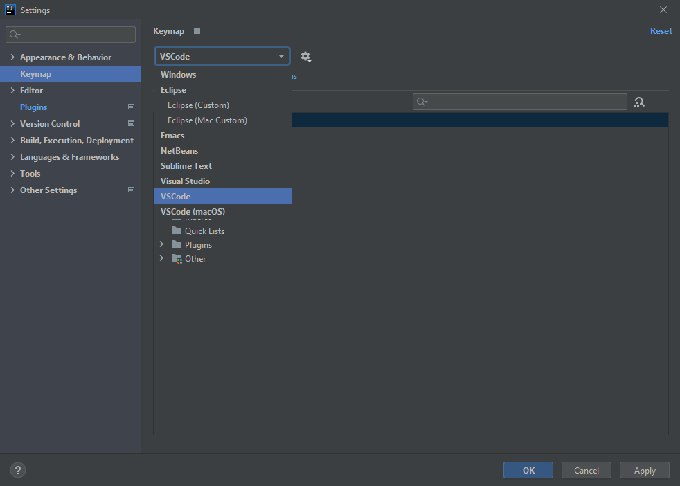
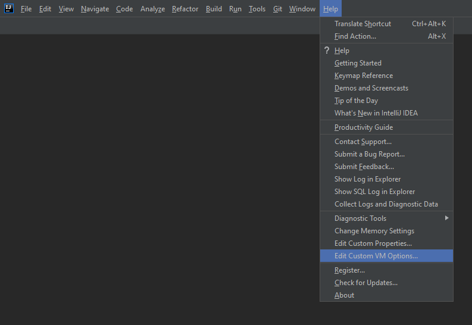
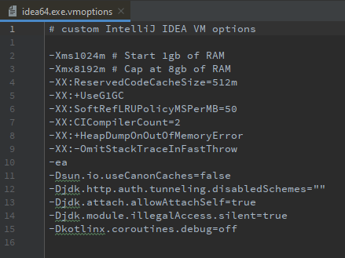

# Intellij Starter

## Preface

I often see developers on VScode or any IDE hesistant to switch over and try
IntelliJ Idea. This is understandable, it takes time and effort that you may not
have during the day to experiment and getting the IDE 'just right'.

This guide will serve as a quick start to get a VScode user into a
'comfortable' starting environment.

The focus of this guide will be on **Web Development** and cover the following:

- Opening a project
- Hotkeys
- Performance (optional)

## Versions used

**VSCode**: 1.55.2

**IntelliJ**: IntelliJ IDEA 2021.1 (Ultimate Edition)

## Opening a project

This works for both **existing** and new projects.

IntelliJ **will not** override your exisiting project with 'New Project' so
don't worry.

**New Project**

**Selecting project type**

**Navigate to project**

## Hotkeys

**Opening IDE settings**

**Downloading VScode keymap**

**Activating VScode keymap**

## Performance (optional)

If you're seeing poor preformance the quickest way to increase IntelliJ's
preformance is to give it more RAM.

**Opening the VM Options**

**Allocating more RAM**

# Questions/Comments?

Just create a new issue in this repo.
